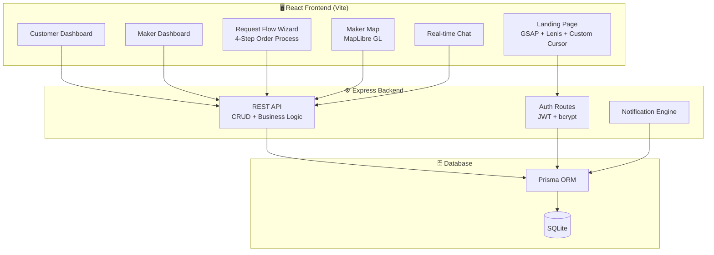

<p align="center">
  <h1 align="center">🪑 KaariGhar — कारीघर</h1>
  <p align="center"><strong>India's First Transparent Custom Furniture Marketplace</strong></p>
  <p align="center">
    Connecting customers with verified master craftsmen through milestone-based escrow payments, live order tracking, AI-assisted specs, and honest GST-inclusive pricing.
  </p>
</p>

<p align="center">
  
  
  
  
  
  
</p>

---

## ✨ Features

| Feature | Description |
|---------|-------------|
| 🔍 **Verified Makers** | Background-checked craftsmen with on-site workshop visits, GST registration, and ID verification |
| 💰 **Transparent Quoting** | Full cost breakdowns — materials, labour, delivery, commission, and GST. Zero hidden charges |
| 🔒 **Milestone Escrow** | Three-phase payments (Raw Material → Frame → Finishing & Delivery), each unlocked by photo-verified proof |
| 🤖 **AI-Assisted Requests** | Upload a reference image; AI suggests wood type, finish, dimensions, style, and generates a structured spec sheet |
| 💬 **Real-time Messaging** | Direct chat between customer and maker once a quote is submitted |
| 🗺️ **Maker Map** | MapLibre GL-powered interactive map showing nearby verified craftsmen with availability status |
| 🌐 **Bilingual UI** | Full English & Hindi (`हिंदी`) localisation across all screens |
| 🔔 **Live Notifications** | Polling-based notification system with type-specific icons and unread badges |
| ⭐ **Reviews & Ratings** | 1–5 star reviews with aggregated ratings per maker |
| 📸 **Maker Portfolios** | Image-based portfolio showcasing past work |

---

## 🛠️ Tech Stack

| Layer | Technology |
|-------|-----------|
| **Frontend** | React 19 · Vite · Tailwind CSS v4 · Framer Motion · GSAP · Lenis |
| **Backend** | Express 5 · Node.js |
| **Database** | SQLite (Prisma ORM) |
| **Maps** | MapLibre GL JS |
| **Auth** | JWT (bcrypt password hashing) |
| **i18n** | Custom `t(key, lang)` helper with EN/HI translations |

---

## 🏗️ Architecture



---

## 🔄 Core User Journey

```mermaid
flowchart LR
    A[Customer Signs Up] --> B[Describe Dream Furniture]
    B --> C[AI Analyzes & Suggests Specs]
    C --> D[Submit Structured Request]
    D --> E[Makers Receive & Bid]
    E --> F[Customer Compares Quotes]
    F --> G[Accept Best Quote]
    G --> H[Escrow Phase 1: Raw Material]
    H --> I[Photo Proof → Release Payment]
    I --> J[Escrow Phase 2: Frame]
    J --> K[Photo Proof → Release Payment]
    K --> L[Escrow Phase 3: Finishing & Delivery]
    L --> M[Final Delivery ✓]
    M --> N[Leave Review ⭐]
```



---

## 📁 Project Structure

```
KaariGhar/
├── src/                    # React frontend
│   ├── App.jsx             # Main router & layout
│   ├── AuthContext.jsx      # Global auth state (JWT)
│   ├── api.js              # Axios API client
│   ├── i18n.js             # EN/HI translations
│   ├── landing/            # Landing page (separate design system)
│   │   ├── LandingPage.jsx
│   │   ├── Hero.jsx
│   │   ├── Marquee.jsx
│   │   └── index.css
│   ├── pages/              # Route-level components
│   │   ├── CustomerDashboard.jsx
│   │   ├── MakerDashboard.jsx
│   │   └── Auth.jsx
│   └── components/         # Shared components
│       ├── RequestFlow.jsx  # 4-step order wizard
│       ├── MakerMap.jsx     # Interactive map
│       ├── EscrowTracker.jsx
│       ├── Chat.jsx
│       └── NotificationBell.jsx
├── server/                 # Express backend
│   └── index.js            # API routes + middleware
├── prisma/                 # Database schema
│   └── schema.prisma
├── public/                 # Static assets
├── package.json
├── vite.config.js
└── vercel.json             # Deployment config
```

---

## 🚀 Quick Start

### Prerequisites

- Node.js 18+
- npm or yarn

### 1. Clone & Install

```bash
git clone https://github.com/deevashb24/KaariGhar.git
cd KaariGhar
npm install
```

### 2. Set Up Database

```bash
npx prisma generate
npx prisma db push
```

### 3. Seed Sample Data (Optional)

```bash
node server/seed_makers.js
node server/seed_customer.js
```

### 4. Start Development Server

```bash
# Start backend (in one terminal)
node server/index.js

# Start frontend (in another terminal)
npm run dev
```

The app will be available at `http://localhost:5173`

---

## 📸 Screenshots

> _Screenshots coming soon — run the app locally to explore the full experience._

---

## 🤝 Contributing

Contributions are welcome! Please open an issue first to discuss what you'd like to change.

1. Fork the repo
2. Create your feature branch (`git checkout -b feature/amazing-feature`)
3. Commit your changes (`git commit -m 'Add amazing feature'`)
4. Push to the branch (`git push origin feature/amazing-feature`)
5. Open a Pull Request

---

## 📄 License

This project is open source and available under the [MIT License](LICENSE).

---

<p align="center">
  <strong>Built with ❤️ for India's artisan economy</strong>
</p>
